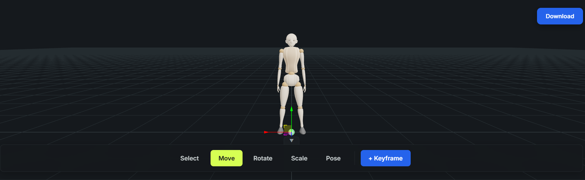

# Shot Composer

A free, browser-based 3D shot composer for previsualizing cinematic shots before generating AI video or images. Instead of describing camera position, framing, and character pose entirely in a text prompt, block the shot out visually first — pose characters, frame the camera, add movement — then use that visual direction as a reference for your AI video/image prompt.

Everything runs locally in the browser. There is no backend, no account, and no data leaves your machine — saved poses, scenes, and motions are kept in your browser's `localStorage`.

**Repository**: https://github.com/Anujatk1999/open-media



## What is Shot Composer?

- Add characters and objects
- Pose characters, or apply a saved pose
- Choose a shot size and camera angle, including Over-the-Shoulder (OTS)
- Adjust camera elevation and composition
- Add and animate cameras with keyframes for shots that move
- Capture a static frame, or preview a motion shot
- Save and reuse scenes, poses, and motions from the Shot Library

## Static vs Motion

Shot Composer has one unified composer with two modes, switchable at any time from the top bar without losing your scene:

- **Static** — compose a single cinematic frame: Character → Pose → Camera → Shot Size → Angle → Elevation → Composition → Capture.
- **Motion** — add keyframes to animate characters, objects, and cameras over time, then preview and export: Build the shot → Switch to Motion → Add keyframes → Preview → Export.

## Interface

- **Scene panel** (left) — add Male/Female/Child characters, Cube/Plane/Cylinder/Sphere/Capsule/Cone/Torus primitives, and (in Motion mode) cameras. Select, rename, duplicate, and delete objects.
- **Viewport** (center) — select, move, rotate, scale, and pose objects; position cameras; preview the scene.
- **Inspector** (right) — contextual tabs for Shot, Object, Motion, Camera, Pose, and Composition. Collapsible for more viewport space.
- **Bottom strip** — the Shot Strip in Static mode (captured shot), or the Timeline in Motion mode (play/pause, stop, scrub, speed, duration, keyframes).

## Camera and framing

- **Shot Size** — Wide, Full, Medium, MCU (Medium Close-Up), Close-Up
- **Camera Angle** — Front, 3/4 Left, 3/4 Right, Profile, Back, Over the Shoulder
- **Over-the-Shoulder (OTS)** — a real spatial camera relationship: the camera sits behind and slightly to one side of the selected character, near shoulder/head height, looking past them toward another character or the scene
- **Elevation** — Eye Level, High, Low
- **Composition** — Center, Left Third, Right Third, Upper Third, Lower Third, Negative Space
- Works on any selected character or primitive (a bare camera can't be framed as a subject) — OTS auto-targets the nearest other character in the scene
- Orbit/pan/dolly viewport navigation, grid toggle, and a Composition mode for arrow-key camera pedestal/truck adjustments

## Posing

- Click any body part in the viewport to select that joint, or drag its rotation-ring gizmo
- Numeric sliders and inputs in the Inspector for every joint's degrees of freedom (mannequin.js's `raise`, `straddle`, `bend`, `tilt`, `turn`), including finger chains
- Apply a pose from the bundled Pose Library, or save/update/delete your own poses
- Reset Pose restores the figure's default posture

## Motion and keyframes

- Add cameras and animate character, object, and camera transforms (including rotation) with keyframes — any character, primitive, or camera can be independently keyframed and played back concurrently on the same shared timeline, via a "+ Keyframe" button or double-clicking the timeline
- Timeline controls: play/pause, stop, scrub, speed, and duration
- **Motion Shot Sequence** — chain Shot Combination framings (Wide → OTS → Medium → Close-up, etc.) into a cut list; each shot re-solves live against its target's current bounding box, so framing holds correct even while the target moves. Rendered through one dedicated cinematic camera, never a scene camera object
- **Camera rigs** — `follow` (fixed offset from a moving target), `orbit` (360° sweep), or `shot` (continuously re-solved framing) — procedural per-camera behavior with no per-frame keyframing required
- Multiple camera objects supported per scene, each independently keyframed; pick which one is the active/viewing camera for preview and export
- Save a motion (keyframe track) for reuse from the Motion Library

## Saving your work

| Action | What it saves |
| --- | --- |
| **Save Scene** | The complete editable scene, to continue editing later |
| **Save Pose** | A reusable character pose |
| **Save Motion** | Motion/keyframe data, to reuse on another shot |

## Shot Library

A separate browsable gallery (`/library.html`) of shot configurations and reusable setups, organized by **Composition**, **Camera Angle**, **Pose Library**, **Motion Library**, and **Community** (community scenes are a coming-soon placeholder). Opens the live 3D composer in a new tab to preview or apply an entry — a starting point for shots you don't want to build from scratch.

## Help Center

An in-app documentation hub (`/help.html`) covering the full workflow, camera/OTS guidance, motion and keyframes, saving, the Shot Library, keyboard shortcuts, and an AI video prompt-writing guide. Open it any time from the ⓘ button in the composer, in both Static and Motion modes — it opens in a new tab.

## Keyboard shortcuts

| Shortcut | Action |
| --- | --- |
| `M` / `R` / `S` / `P` | Move / Rotate / Scale / Pose tool |
| `Ctrl`/`Cmd` + `Z` | Undo |
| `Ctrl`/`Cmd` + `Shift` + `Z`, or `Ctrl`/`Cmd` + `Y` | Redo |
| `Ctrl`/`Cmd` + `D` | Duplicate |
| `Delete` / `Backspace` | Delete |
| `Escape` | Clear selection |
| `Space` | Play / Pause (Motion mode) |
| `Arrow Keys` | Move playhead by one frame (Motion mode) |
| `Shift` + `Arrow Keys` | Move playhead by one second (Motion mode) |

Shortcuts are ignored while a text field is focused.

## Export

- **Capture Shot** saves the current Static-mode viewport as a timestamped PNG reference for your AI prompt
- **Export MP4** renders the full Motion timeline (Shot Sequence and/or keyframed objects) to a downloaded video file, in real time

## AI / MCP

Shot Composer ships a local [Model Context Protocol](https://modelcontextprotocol.io) server (`mcp/`) that lets an AI coding agent (Claude Code, Codex, Cursor, etc.) drive a running composer tab directly — build scenes, pose characters, frame shots, keyframe motion, and save results through the same actions the UI uses. It's local-first: no account, backend, or deployment involved.

```bash
cd mcp
npm install
npm start
```

See [`mcp/README.md`](mcp/README.md) for the full tool reference, connection instructions for various agents, and example prompts.

## Getting started

Requires **Node.js 18+**.

```bash
git clone https://github.com/Anujatk1999/open-media.git
cd open-media
npm install
npm run dev
```

The dev server prints a local URL (typically `http://localhost:5173`). Open it, then follow through to the Shot Library and composer.

## Scripts

| Command | Description |
| --- | --- |
| `npm run dev` | Start the Vite dev server with hot reload |
| `npm run build` | Type check (`tsc --noEmit`) and build to `dist/` |

## Project structure

```
public/
├── poses/                          # Bundled pose library (JSON)
└── help/                           # Help Center screenshots

src/
├── main.tsx                        # Landing/composer entry (index.html)
├── library-main.tsx                # Shot Library entry (library.html)
├── help-main.tsx                   # Help Center entry (help.html)
├── ComposerShell.tsx                # Static/Motion composer layout, mode toggle, shortcuts
├── app/
│   ├── App.tsx                     # Routes: / (landing) and /composer
│   └── app.css
├── modules/composer/
│   ├── ComposerViewport.tsx        # R3F canvas, tools, capture
│   ├── WorkspaceToolbar.tsx        # Tool switching, grid, capture
│   ├── SceneTree.tsx               # Scene panel: characters, primitives, cameras
│   ├── Inspector.tsx               # Shot/Object/Motion/Camera/Pose/Composition tabs
│   ├── ShotBuilderPanel.tsx        # Shot size, camera angle, elevation, composition
│   ├── ShotPreview.tsx             # Shot Strip (Static mode)
│   ├── PosePanel.tsx / PoseControls.tsx / JointControls.tsx / JointGizmo.tsx
│   ├── TransformGizmo.tsx          # Move / rotate / scale gizmos
│   ├── MannequinObject.tsx         # mannequin.js figure wrapper
│   ├── PrimitiveObject.tsx         # Primitive mesh wrapper
│   ├── CompositionControls.tsx
│   ├── cameraUtils.ts              # Framing and view presets
│   └── helpers/                    # Joint config, mirroring, pose (de)serialization
├── modules/motion/                 # Motion mode: timeline, keyframes, shot sequence
│   ├── Timeline.tsx                # Per-object keyframe track UI
│   ├── ShotSequenceTimeline.tsx    # Motion Shot Sequence cut-list UI
│   ├── CameraObject.tsx / CameraViewfinder.tsx / CameraInspectorPanel.tsx
│   ├── PoseLibraryPanel.tsx
│   ├── motionPresets.ts
│   └── helpers/                    # Keyframe sampling, camera rigs, shot sequence, motion/scene library persistence
├── modules/library/
│   ├── LibraryPage.tsx             # Shell for library.html
│   ├── calibration/                # Shot Library UI, thumbnails, shot solving
│   └── model/                      # Unified LibraryEntry model across all sources
├── modules/help/
│   └── HelpPage.tsx                # Help Center content
├── stores/
│   └── composerStore.ts            # Zustand scene state, undo history, keyframes, shot sequence
└── types/
    └── mannequin-js.d.ts
```

## Tech stack

| Package | Role |
| --- | --- |
| [React](https://react.dev/) + [TypeScript](https://www.typescriptlang.org/) | UI and type safety |
| [Vite](https://vite.dev/) | Dev server and build |
| [three.js](https://threejs.org/) | WebGL rendering |
| [@react-three/fiber](https://github.com/pmndrs/react-three-fiber) + [drei](https://github.com/pmndrs/drei) | React renderer for three.js |
| [mannequin.js](https://github.com/boytchev/mannequin.js) | Articulated human figures |
| [React Router](https://reactrouter.com/) | Routing |
| [Zustand](https://github.com/pmndrs/zustand) | State management |

## Data and persistence

Scene contents live in memory and are cleared on reload unless saved. Saved scenes, poses, and motions persist in browser `localStorage`, per browser, with no server involved.

## Deployment

`npm run build` emits a fully static site to `dist/`, deployable to any static host. Configure your host to serve it as a single-page application so that client-side routes such as `/composer` fall back to `index.html`.

## Security

See [SECURITY.md](SECURITY.md) for how to report vulnerabilities.

## Contributing

See [CONTRIBUTING.md](CONTRIBUTING.md).

## License

[MIT](LICENSE)
